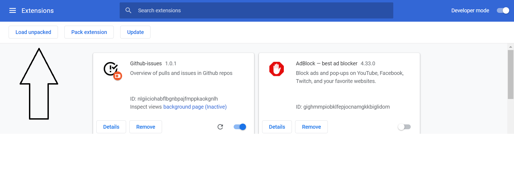

## Setup

First you need to fetch the project which can be done cloning the repository with git.

```bash
$ git clone https://github.com/arnar44/github-chrome-extension.git
```

Next the dependancies for the project need to be installed, which can be done with yarn or npm.

```bash
$ npm install
```

After dependancies have been installed, you will need to build the app and load it to your chrome browser. First run:

```bash
$ npm run buildApp
```

When the app has been built, you should see a "build" directory in the project directory. Now open your browser and press the chrome extensions logo which should be in the top right corner of the browser:

 

 Then press "Manage Extensions".

 On the extensions page, make sure "Developer mode" is turned on. The option to toggle it on/off should be in the top right corner of the page:

  

  No you can press "Load unpacked" in the top left corner. 
  

  You should navigate to the project directory and select the "build" folder which you produced earlier. 

  By pressing the extensions logo you should now see our chrome extension there and you can pin it so it stays visible next to your other extensions. 

  Now you are all set and can start using the chrome extension!

  ## Using the extension
  To be able to use the extension you will need to generate a [Github access token](https://docs.github.com/en/github/authenticating-to-github/keeping-your-account-and-data-secure/creating-a-personal-access-token). You need to make sure that the scope of the token includes access to reporitories and invite/remove authorization for repository collaborators and pull requests requested reviewers. 

  When you open the extension for the first time you need to submit your username and access token. After that you need to select repositories to view. 

  Pull requests for those repositories will be fetched and listed, you can select a pull request and:
- Add/remove collaborators for the repository in which the pull request is in.
- Add/remove requested reviewers for each of the pull requests.
- Set a reminder to remind you to take a look at the pull request again in 5 minutes.

## Tools and architecture
The extension is built with the React library and was bootstrapped with Create React App.

### Stylesheets
Not much emphasis on design and style.
Stylesheets are written in scss and scss variables are placed in config.scss

### Hooks
Hooks are used to manage state and make asynchronous calls to Github API.

### Pages
The logic for the app is in App.js aswell as in the three pages:

- Login.js
- SelectRepos.js
- Main.js

App.js contains the hooks for username, access token and selected repositories. It shows:
- Login if it does not possess the users username and token.
- SelectRepos if it does not posses which repositories the user has selected.
- Main if it has all of username, token and repositories.

Hook for data is stored in Main.js. The data is either fetched from the chrome storage to limit requests made to Github or fetched via the Github REST API. 

### Background
The background directory contains one file, index.js. It is the background script the extension uses, it currently only contains one event listener which listens for chrome alarms. 

## TODOS
Additional features to add to extension:
- Ability to cancel alarms.
- Ability to re-select which repositories to view.
- Change alarms to notifications from extension, currently displayed as an alert.
- Not only list pull request, but issues as well. 
- Push notifications to inform user of new pull requests and events.
- Hash information in chrome storage or store data on a server.